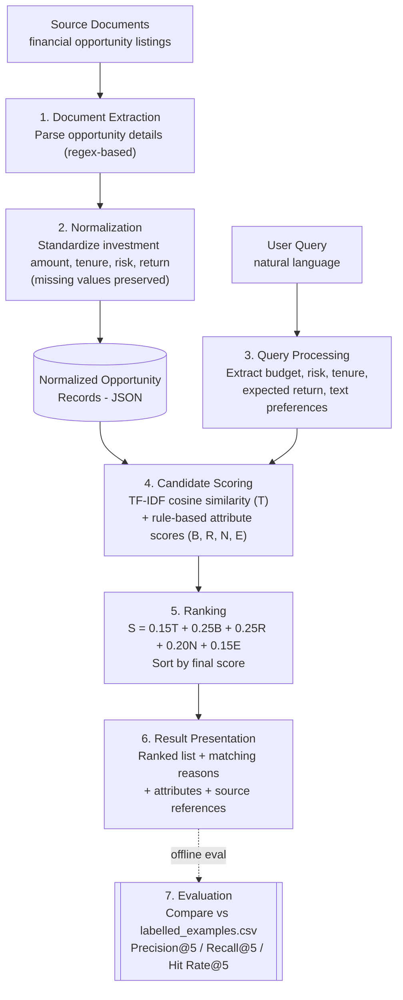

# Technical Note
## Intelligent Financial Opportunity Analysis & Recommendation Engine
*Architecture, Modelling, Failure Modes, Scaling and Production Safeguards*

---

## 1. Architecture and Data Flow

The system follows a linear document-processing and retrieval pipeline with two entry points — the source documents and the user's natural-language query — that converge at the scoring stage. The pipeline has seven stages, shown below.

*Figure 1. End-to-end architecture and data flow of the recommendation engine.*

### 1.1 Stage-by-Stage Description

1. **Document extraction** — Financial opportunity details (investment amount, tenure, risk category, expected return, descriptive text) are extracted from the supplied documents using pattern-based (regular-expression) parsing.
2. **Normalization** — Extracted values are converted into a consistent structured format (e.g. numeric investment amounts, standardized tenure units, a fixed risk vocabulary). Values that cannot be extracted are preserved as missing rather than inferred or defaulted.
3. **Query processing** — The user's natural-language query is parsed in parallel to identify structured preferences (budget, risk, tenure, expected return) and residual free-text preferences used for textual matching.
4. **Candidate scoring** — Each normalized opportunity is scored against the parsed query on two tracks: a TF-IDF / cosine-similarity textual relevance score, and rule-based structured attribute-match scores for budget, risk, tenure and expected return.
5. **Ranking** — The five component scores are combined into a single weighted score (S = 0.15T + 0.25B + 0.25R + 0.20N + 0.15E) and opportunities are sorted in descending order of S.
6. **Result presentation** — The ranked opportunities are returned together with their final score, the matching reasons, the relevant attributes, and a reference back to the source document each opportunity was extracted from.
7. **Evaluation (offline)** — Retrieved results are compared against `labelled_examples.csv` to compute Precision@5, Recall@5 and Hit Rate@5. This stage runs separately from the live query path and is used to assess retrieval quality, not to serve results.

### 1.2 Data Flow Characteristics

- Two independent inputs (documents, query) are processed by separate pipelines that only meet at the candidate-scoring stage — document normalization does not depend on any query, so it can run once and be reused across many queries.
- Normalized opportunity records are the single structured representation consumed by scoring; the extraction/normalization stage is the only place where raw document text is parsed.
- The evaluation stage is decoupled from the live retrieval path (dashed edge in Figure 1): it consumes the same ranked output but is run offline against labelled data, not on every user query.
- Every stage is traceable back to a source document, which supports the explainability requirement described in Section 2.

---

## 2. Modelling Choices and Assumptions

### 2.1 Modelling Choices

- TF-IDF representations with cosine similarity are used to estimate textual relevance between the query and opportunity descriptions.
- Rule-based scoring (rather than a learned model) evaluates structured financial preferences — budget, risk, tenure and expected return.
- A fixed weighted-sum formula (S = 0.15T + 0.25B + 0.25R + 0.20N + 0.15E) combines the five component scores into a single ranking score, with budget and risk weighted highest as the most explicit constraints.
- Source-document references are attached to every result to support traceability and explainability.
- A small labelled set (8 queries) is used to evaluate retrieval relevance via Precision@5, Recall@5 and Hit Rate@5.

### 2.2 Assumptions

- The supplied documents contain information that is actually relevant to the evaluation queries.
- User preferences expressed in natural language can be reliably parsed into the same attribute schema used for opportunities (budget, risk, tenure, expected return).
- The fixed weights (0.15 / 0.25 / 0.25 / 0.20 / 0.15) are a reasonable initial ranking scheme, not a tuned or learned optimum — they have not been validated against a training dataset.
- The 8 labelled examples are treated as ground-truth relevance judgments for evaluation purposes.
- Missing attribute values are treated as unknown, not as failing or passing a match — they are excluded from scoring rather than penalized or assumed favorable.

---

## 3. Failure Modes

The following failure modes were identified as part of the current design; the Q007 case in the evaluation (Section 5.4 of the underlying analysis) is a concrete instance of "irrelevant/incomplete top results" below.

- **Ambiguous queries** — the rule-based parser may misinterpret unclear, colloquial, or unusually phrased preferences (e.g. an implicit rather than explicit budget).
- **Missing data** — missing investment, risk, tenure, or return information in a source document can prevent an opportunity from being matched accurately, even when it is genuinely relevant.
- **Irrelevant or incomplete top results** — the system can surface opportunities that do not reflect the user's actual intent, or miss some genuinely relevant opportunities within the top-5 window, as seen in the Q007 failure analysis (2 of 4 labelled-relevant opportunities retrieved).
- **Fixed weights that do not generalize** — the current weighting (0.15/0.25/0.25/0.20/0.15) was set by design judgement rather than learned from data, so it may not be optimal for query types or datasets outside the 8 labelled examples.
- **Extraction errors** — incorrect values pulled from source documents propagate directly into incorrect matching and ranking downstream.
- **Unverified return guarantees** — the system does not independently verify whether a stated expected return is realistic or guaranteed; presenting it as such would be a safety failure, not just an accuracy one.
- **Placeholder confidence** — `extraction_confidence = 1.0` is a fixed placeholder rather than a calibrated measure, so it cannot currently be used to flag low-confidence extractions.

---

## 4. Scaling Approach for 10 Million Documents

The current prototype has been built and evaluated on the supplied assessment dataset only, and has not been benchmarked at scale. It performs extraction, normalization and TF-IDF scoring per query, which does not scale efficiently to 10 million documents. The proposed approach separates one-time offline work from per-query online work:

| Phase | Step | Purpose |
|---|---|---|
| Offline | Offline preprocessing | Extract and normalize all documents once, rather than repeating this work on every query. |
| Offline | Database storage | Persist normalized opportunity records and metadata in a store designed for large-scale, low-latency access. |
| Offline | Precomputed indexes | Build and maintain text indexes and reusable document representations (e.g. TF-IDF vectors) ahead of query time. |
| Online | Candidate filtering | Apply structured filters (budget, tenure, risk) first to reduce 10M documents to a much smaller candidate set. |
| Online | Efficient retrieval | Use indexed text retrieval over the filtered set; evaluate approximate-nearest-neighbor methods if embedding-based retrieval is introduced later. |
| Online | Reranking | Apply the full hybrid scoring formula (Section 1) only to the smaller candidate set, not the whole corpus. |
| Validation | Performance testing | Benchmark latency, throughput, memory usage, indexing time and retrieval quality at increasing dataset sizes. |

> **Note:** these are proposed scaling measures, not results measured on the current implementation, which has only been run against the supplied assessment dataset.

---

## 5. Improving Evaluation with More Labelled Data

The current evaluation uses only 8 labelled queries, which is sufficient to demonstrate the metric but too small to establish generalizable performance. A larger, more diverse labelled dataset would allow the project to:

- Evaluate a wider range of query types and wording variations, rather than the 8 patterns currently covered.
- Identify recurring query-parsing and retrieval failures (such as the Q007 case) with enough repetition to distinguish systematic issues from one-off noise.
- Measure Precision@5, Recall@5 and Hit Rate@5 on a statistically meaningful sample, with confidence intervals rather than a single mean over 8 points.
- Compare alternative ranking weights (in place of the fixed 0.15/0.25/0.25/0.20/0.15 scheme) against a held-out validation set.
- Maintain a separate held-out test set, distinct from the validation set, for unbiased final performance reporting.
- Investigate learning-to-rank methods once enough reliable relevance labels exist to train them.

More labelled data would improve the reliability of evaluation and could support tuning of the ranking weights — it would not, by itself, guarantee better retrieval performance.

---

## 6. Production Safeguards for a Financial Setting

At minimum, the following two safeguards are required before this system is used in a live financial setting; two further safeguards are included for completeness.

### 6.1 Source Traceability (required)
Every recommendation must include the source-document reference and the specific extracted information that produced the match, so a user (or a reviewer) can verify the underlying details rather than trusting the score alone.

### 6.2 No Unsupported Return Guarantees (required)
Expected returns must never be presented as guaranteed. Where return information has not been independently verified, the system must disclose this explicitly rather than implying certainty.

### 6.3 Missing-Data Handling
Missing attribute values must remain visibly missing — never invented, defaulted, or silently treated as a confirmed match — and the system should disclose when an important attribute used in scoring was unavailable.

### 6.4 Clear Limitations and Scope
Ranking scores must be described as query-matching scores only, not as measures of investment safety, predictions of future performance, or personalized financial advice. Outputs should state this scope explicitly.

*These are proposed production requirements based on the current prototype; the prototype itself does not establish regulatory compliance or independent verification of the underlying financial products.*